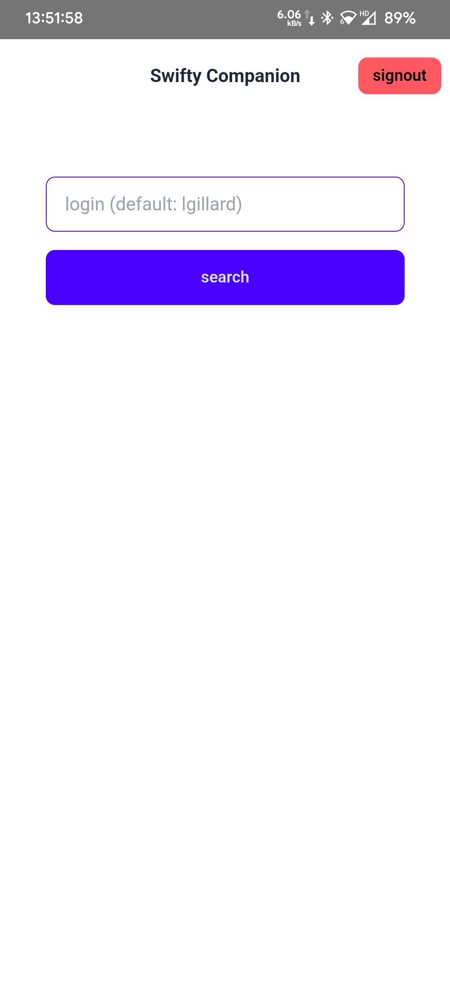
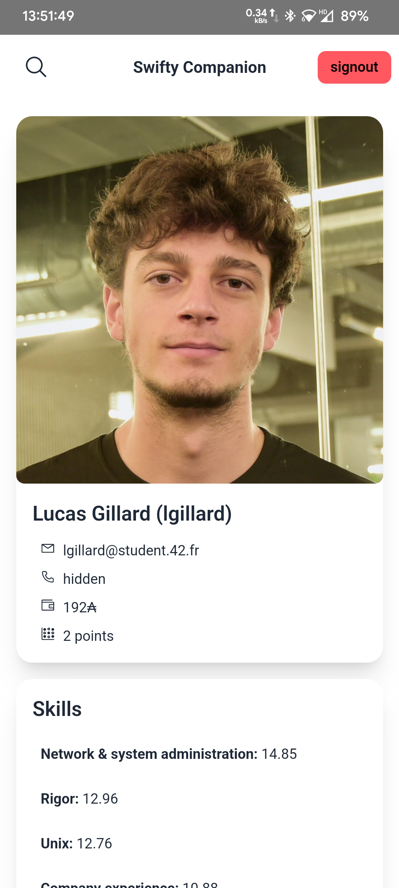
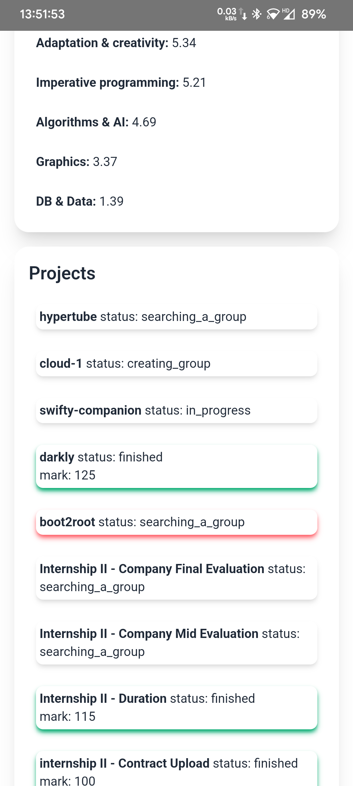

### reasons for capacitor to be a valid tool for this project:

- “Oui c'est libre (de language) :) [..] Et du coup Ionic (capacitor) est autorisé aussi ? [..] Tu as le droit à tout dans swifty companion. ”https://42born2code.slack.com/archives/C7NF60E0Z/p1627294951310200
- “Capacitor takes your existing web application and runs it as a native app on each platform”
  “Capacitor apps are technically fully native apps. On mobile they use the standard iOS and Android project structure and view hierarchy, of which the Capacitor Web View is a part.”
  https://ionic.io/blog/capacitor-everything-youve-ever-wanted-to-know
- subject says "You can use any compatible frameworks and libraries"
- Not off-topic: difference between ft_hangouts and swifty-companion subject, swifty-companion is about OAuth and 42api on mobile app
- svelte is valid https://projects.intra.42.fr/projects/42cursus-swifty-companion/projects_users/2771932
- React Native AND nativescript directly support webview, could just run the app in it https://docs.nativescript.org/ui/web-view
  https://reactnative.dev/docs/custom-webview-android#javascript-interface

### docker build step:

`docker build -t ionic-capacitor github.com/robingenz/docker-ionic-capacitor`
docker run --name capacitor-build-container -v .:/app -w /app ionic-capacitor bash -c "npm i -g pnpm && pnpm install && pnpm nuxt generate && npx cap sync android && cd android && ./gradlew assembleDebug"
`docker cp capacitor-build-container:/app/android/app/build/outputs/apk/debug/app-debug.apk ./app-debug.apk`

### screenshots:

